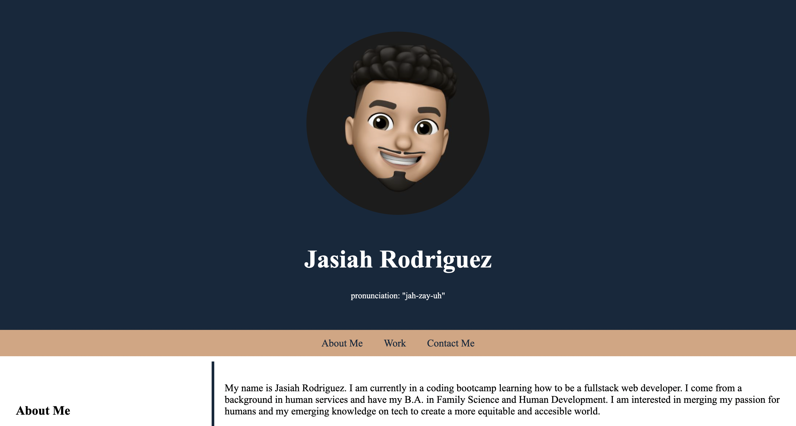
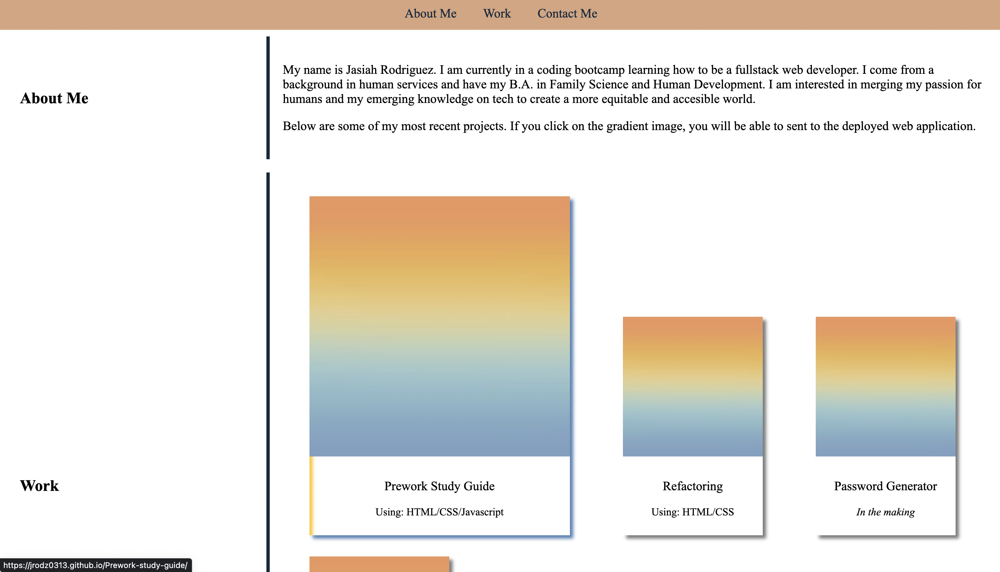
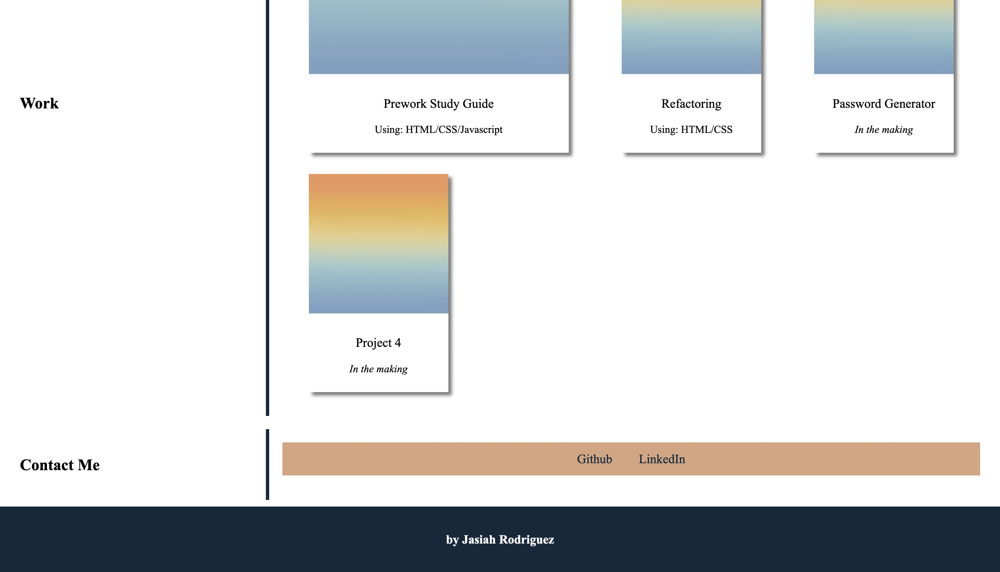

# jrodz-portfolio

## Description
This portfolio was created to display my work to potential employers for them to assess whether I'd be a good fit for an open position. My portfolio contains three main sections: **About Me**,**Work**, and a **Contact** section. The webpage first displays a section that contains some information about who I am and what the viewer can find in my portfolio. Next my work is displayed with the most current project I worked on being the *biggest image* in the **Work** section. Lastly the **Contact** section contains two links for potential employers to see my Github repositories and access my LinkedIn page. The portfolio also displays a responsive layout that adapts to different viewports. 

## Table of Contents 
- [User Story](#user-story)
- [Acceptance Criteria](#acceptance-criteria)
- [Installation](#installation)
- [Usage](#usage)
- [Credits](#credits)
- [License](#license)

## User Story
- AS AN employer 
- I WANT to view a potential employee's deployed portfolio of work samples
- SO THAT I can review samples of their work and assess whether they're a good candidate for an open position

## Acceptance Criteria
- GIVEN I need to sample a potential employee's previous work
- WHEN I load their portfolio
- THEN I am presented with the developer's name, a recent photo or avatar, and links to sections about them, their work, and how to contact them
- WHEN I click one of the links in the navigation
- THEN the UI scrolls to the corresponding section
- WHEN I click on the link to the section about their work
- THEN the UI scrolls to a section with titled images of the developer's applications
- WHEN I am presented with the developer's first application
- THEN that application's image should be larger in size than the others
- WHEN I click on the images of the applications
- THEN I am taken to that deployed application
- WHEN I resize the page or view the site on various screens and devices
- THEN I am presented with a responsive layout that adapts to my viewport

## Installation 
There are no installations needed to view the portfolio. Simply click on the provided link and it will deploy my portfolio:
- **Here is the deployed link:** https://jrodz0313.github.io/jrodz-portfolio/
- **Here is the repo link:** https://github.com/Jrodz0313/jrodz-portfolio

## Usage
When a link is clicked on in the navigation bar, the UI will scroll to the corresponding section on the webpage. The **About Me** section gives a brief description of who I am, my educational background, and what I wish to offer as a fullstack developer. 

The **Work** section contains images that when clicked on deploy the application. Each image card contains the title of the project and what the primary focus was for that specific project in the section that says *Using:*.

The **Contact Me** section contains two links, one to my Github and one to my LinkedIn. When the user clicks on either of the words, it will take them directly to the corresponding link. 

## Credits
N/A

## License
MIT License